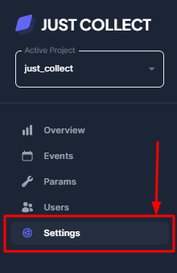

# Инструкция по подключению и настройке Google Analytics к Just Collect

Это руководство поможет вам быстро подключить статистику событий из GA4 в интерфейсе Just Collect
<!-- more -->
Прежде чем выполнить подключение Google Analytics 4 к Just Collect, необходимо
[Организовать доступ сервисного аккаунта Just Collect к Google Analytics](Организовать%20доступ%20сервисного%20аккаунта%20Just%20Collect%20к%20Google%20Analytics).
Затем можно переходить к действиям перечисленным ниже.
1. Перейдите на страницу [Analytics | Home](https://analytics.google.com/analytics/web)  и откройте окно администрирования
   

2. Выберите вкладку **Account access managment**
   
3. Затем добавьте сервисный аккаунт just-collect-etl-dev@just-collect-dev.iam.gserviceaccount.com с ролью **editor** или **analyst**. Теперь можно настроить экспорт статистики в интерфейс Just Collect
	
4. Кликните по ссылке Property details
   
   5. Скопируйте ваш property id
      
   6. Вернитесь в [Just Collect](http://just-collect.ru/) на вкладку **Settings**
      
5. Добавьте ваш **GA property id** в проект
	
6. Перейдите на вкладку **Overview** и проверьте что статистика передается в интерфейс
	